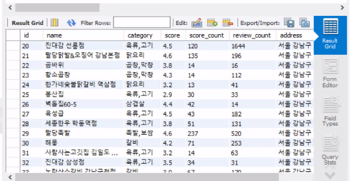

<h1> Django 에서 mysql 연결하여 대용량 데이터 관리하기

<h2> (1) MySQL 에서 새로운 connections 생성

<h3> 1. 새로운 connections 내에 dataset 생성하기

 ```sql

  CREATE DATABASE django_dataset
  CHARACTER SET utf8mb4
  COLLATE utf8mb4_unicode_ci;
 ```

<h2> (2) django 내에서 DB 설정 변경

<h3> 1. master app 의 settings.py 의 DATABASE = {} 설정을 변경한다.

```python
 DATABASES = {
    'default': {
        'ENGINE': 'django.db.backends.mysql',
        'NAME': '<database 명>',
        'USER' : 'root',
        'PASSWORD' : '<비밀번호>',
        'HOST' : 'localhost',
        'PORT' : 3306,
    }
}

 ```

<h3> 2. PASSWORD 보호를 위해 설정한다.

<h3> 3. .env 파일과 .gitignore 파일을 생성한다.
```git
 $ touch .env .gitignore
 $ pip install python-dotenv
```

<h3> 4. settings.py 파일 내에 import 한다.

```python
from dotenv import load_dotenv
import os 

load_dotenv()
```

<h3> 5. https://www.toptal.com/developers/gitignore/ 사이트에서 .gitignore 에 추가할 설정을 일괄로 받는다.

<h3> 6. 위에서 생성한 .env 파일내에 비밀번호를 설정한다.

```sql
MYSQL_PASSWORD = '<비밀번호>'
```

<h3> 7. .gitignore 파일에 .env 파일이 존재하는지 확인한다.

<h3> 8. migrate 하고 MySql 에서 진행한다.

```python
python manage.py migrate
```

<h2> (3) Django 에서 원하는 사이트 크롤할 파일을 만든다.

<h3> 1. selenium 을 이용한다.

```python
   pip install selenium
```

<h3> 2. selenium을 이용할 파일을 생성하여 파싱할 수 있는 패키지 들을 import 한다.

```python
import csv
import time
from bs4 import BeautifulSoup
from selenium import webdriver
from selenium.webdriver.common.keys import Keys
from selenium.webdriver.common.by import By
from selenium.webdriver.support import expected_conditions as EC
from selenium.webdriver.support.ui import WebDriverWait
```


<h3> 3. 예시로 카카오 맵의 음식점을 사용한다.

```python
URL = 'https://map.kakao.com/'
driver = webdriver.Chrome()
driver.get(URL)

def wait_to_search(sec, selector):
    try:
        result = WebDriverWait(driver, sec).until(
            EC.presence_of_element_located((By.CSS_SELECTOR, selector))
        )
        return result
    except:
        print(selector, '셀렉터로 검색 불가')
        driver.quit()


search_input = wait_to_search(5, '#search\.keyword\.query')
search_input.send_keys('고기집')
search_input.send_keys(Keys.ENTER)
time.sleep(1.5)
# 장소 탭 클릭
location_tab = wait_to_search(5, '#info\.main\.options > li.option1 > a')
location_tab.send_keys(Keys.ENTER)
time.sleep(1)

# csv 파일 쓰기
f = open('kakao_places.csv', 'a', encoding='utf-8', newline='')
wr = csv.writer(f)
# csv 헤더 작성
wr.writerow(['name', 'category', 'score', 'score_count', 'review_count', 'address', 'detail_url'])

# page 고르기 (5페이지만 긁기)
for i in range(5):
    page = wait_to_search(3, f'#info\.search\.page\.no{i+1}')
    page.send_keys(Keys.ENTER)
    time.sleep(1)

    places = driver.find_elements(By.CSS_SELECTOR, '#info\.search\.place\.list > .PlaceItem')
    for place in places:
        html = place.get_attribute('innerHTML')
        soup = BeautifulSoup(html, 'html.parser')

        # HIDDEN 클래스가 있다 => 보여주는 중이다. 
        is_showing = bool(soup.select_one('div.rating.clickArea > span.txt_blind.HIDDEN'))
        if is_showing:
            name = soup.select_one('div.head_item.clickArea > strong > a.link_name').text
            category = soup.select_one('div.head_item.clickArea > span').text
            score_count = int(soup.select_one('div.rating.clickArea > span.score > a').text.rstrip('건').replace(',', ''))
            score = float(soup.select_one('div.rating.clickArea > span.score > em').text)
            review_count = int(soup.select_one('div.rating.clickArea > a > em').text.replace(',', ''))
            address = soup.select_one('div.info_item > div.addr > p:nth-child(1)').text
            detail_url = soup.select_one('div.info_item > div.contact.clickArea > a.moreview')['href']
            # 줄 추가
            wr.writerow([name, category, score, score_count, review_count, address, detail_url])
f.close()

```

<h2> (4) 새로운 앱을 만들어 models.py 파일 내에 모델 정의

<h3> 1. models.py 내에 방금 수집한 정보를 기반으로 model 만들기

```python
from django.db import models

class KakaoRestaurant(models.Model):
    name = models.CharField(max_length=200)
    category = models.CharField(max_length=200)
    score = models.FloatField(default=0)
    score_count = models.IntegerField(default=0)
    review_count = models.IntegerField(default=0)
    address = models.CharField(max_length=200)
    detail_url = models.URLField()

    class Meta:
        db_table = 'kakao_restaurants'
        db_table_comment = '카카오 맵 selenium 스크래핑으로 저장한 데이터'
        # ordering 지정시) restaurants = KakaoRestaurant.objects.all()  => ORDER BY score desc, score_count desc
        ordering = ['-score', '-score_count']  
        
```

<h3> 2. sql로 migrate 

```python
python manage.py makemigrations
pytho manage.py migrate
```

<h3> 3. sql 내에 SCHEMAS 생성 확인

