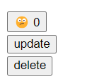
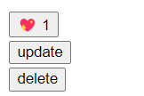

<h2> 사이트 내 Like 기능 생성

<h3> 1. DB 내에 테이블을 생성하기

   <h4> 1) board app 의 models.py 에 해당 class 아래 like_users 생성한다.
   
   ```python
    user = models.ForeignKey(settings.AUTH_USER_MODEL, on_delete=models.CASCADE)
    # User : Articles = M :N => 좋아요

    like_users = models.ManyToManyField(settings.AUTH_USER_MODEL, related_name='like_articles')
   ```

   <h4> 2) DB로 migrate 해 테이블 생성한다.
   
   ```python
   python manage.py makemigrations 
   python manage.py migrate 
   ```

   <h4> 3) DB에 board_article_like_users 테이블 확인
   
<h3> 2. board/urls.py 로 이동해 like_users 가 작동할 urlpatterns 만들기
   
   ```python
   path('<int:article_pk>/like/', views.article_like, name='article_like')
   ```

<h3> 3. board/views.py 내에 like_users 가 작동할 함수 작성하기
   
```python
   @login_required # 로그인 한 사용자만 좋아요 가능
   @require_POST # POST 방식으로만 받는다.
   def article_like(request, article_pk):
       article = get_object_or_404(Article, pk=article_pk)
       user = request.user
    return redirect('board:article_detail', article.pk) # article pk로 넘겨서 html에서 받는다.

```

<h3> 4. board/detail.html 에서 기본 like ui 작성


    ```html
     
    <div>
      <form action="" method = "POST">
        
        <button>
          {{article.like_users.count}}
        </button>
       </form>
    </div>
    
    ```
<h3> 5. like UI 기능 추가하기

<h4> 1) like 버튼 다시 누르면 like 취소 되도록 설정
   
   ```python
    def article_like(request, article_pk):
        article = get_object_or_404(Article, pk=article_pk)
        user = request.user

        # 만약 user가 article 에 좋아요를 누르지 않았다면
        # 아래 둘 중 코드 선택 
        # if user not in article.like_users.all(): DB 에서 받아와 파이썬에서 데이터를 처리
        # 아래의 식이 효율적, 데이터베이스에서 찾아서 주는 것, 데이터가 많아질수록 더욱 효율성이 높다.
        if not article.like_users.filter(pk=user.pk).exists():
            article.like_users.add(user)
        # user.like_articles.add(article)
        # 만약 user가 article 에 좋아요 눌러둔 상태라면
        else :
            article.like_users.remove(user)
        return redirect('board:article_detail', article.pk)
   ```

   <h4> 2) LIKE 누른 상태와 아닌 상태를 구분할 수 있도록 경우를 나누어 사용
   
   - 메서드를 html에서 사용할 수 없기 때문에 detail 함수에서 변수화
   
```python
    is_like = article.like_users.filter(pk=request.user.pk).exists()
    return render(request, 'board/detail.html', {
    'article': article,
    'form': form,
    'is_like' : is_like,
    })
```

- detail.html 내에 POST로 보낼 수 있는 form 을 만들고 if else 문 내에 해당 변수를 사용해 작동 변경

```html
      <form action="" method = "POST">
       
        <button>
         💖🫤
         {{article.like_users.count}}
        </button>
       </form>
```
<h3> 결과

<h4> - like 를 한 사람, 해당 유저가 버튼을 사용하였는 지 여부, 취소 가능 한 like 버튼 생성


- like 를 누르지 않았을 경우



- like 를 눌렀을 경우




    
